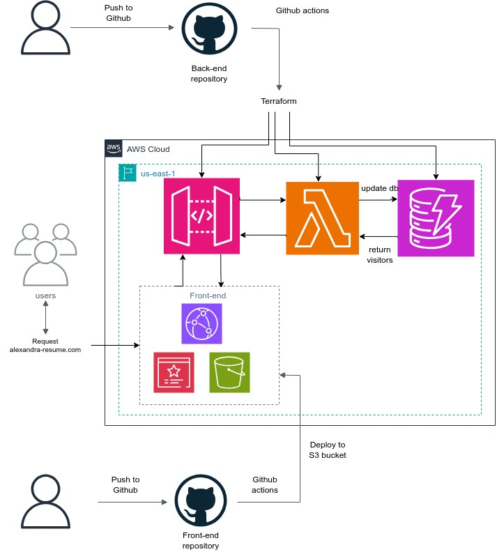

<!DOCTYPE html>
<html>

<head>
</head>

<body>

  <h1>AWS Cloud Resume Challenge</h1>

  <section>
    <h2>About the project</h2>
    
This is my Cloud Resume Challenge built on AWS. It's a static website hosted on AWS S3 bucket, with a visitor counter built on AWS Lambda functions. The website is built with HTML, CSS, and JavaScript. The visitor counter is built with Python and AWS lambda functions.

  </section>
<section> 
</section>
  <section>
  
  <h2> AWS services used </h2>
    <ul>
    <li>Route 53</li>
    <li>S3 bucket</li>
    <li>Cloudfront</li>
    <li>Certificate Manager</li>
    <li>Lambda function</li>
    <li>API Gateway</li>
    <li>DynamoDb</li>
  </ul>
  </section>

  <section>
    <h2>Website Link</h2>
    
https://alexandra-resume.com/

  </section>

</body>

</html>
